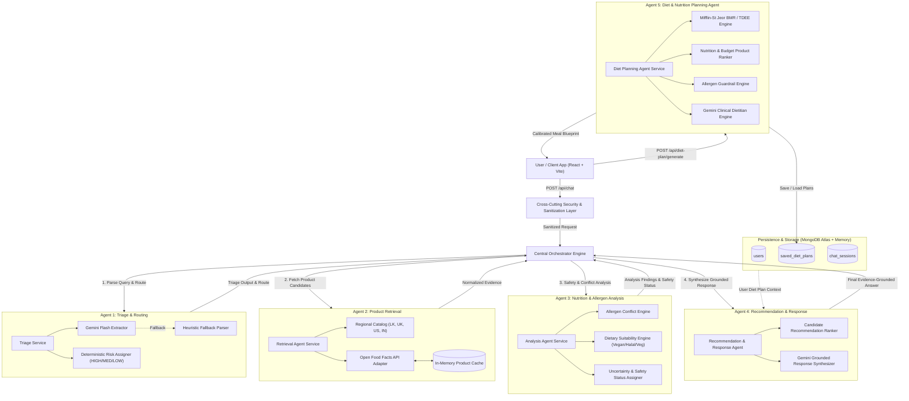

# EviBite AI 🥗

**Multi-Agent Supermarket Product Intelligence & Dietary Planning System (v2.4)**  
*IT3041 – Information Retrieval & Web Analytics*

[](https://python.org)
[](https://fastapi.tiangolo.com)
[](https://react.dev)
[](https://vitejs.dev)
[](https://mongodb.com)
[](https://ai.google.dev)
[](https://world.openfoodfacts.org)

EviBite AI is an end-to-end multi-agent AI system designed to audit packaged supermarket goods, analyze allergens and nutritional parameters, provide grounded chatbot consultations, and synthesize clinically calibrated personalized diet plans grounded in regional supermarket inventories.

---

## 1. System Overview & Core Capabilities

EviBite AI addresses two fundamental challenges in modern grocery shopping and dietary management:
1. **Product Intelligence & Safety**: Instant allergen conflict screening, ingredient verification, and grounded nutritional evaluations across global and regional supermarket products.
2. **Personalized Diet Planning**: Tailoring clinical dietitian strategies to individual biometric energy needs (Mifflin-St Jeor BMR, TDEE, WHO BMI) and structuring meals exclusively with verified, regionally available supermarket goods (Sri Lanka, United Kingdom, United States, India, Global).
3. **Cross-Agent Context Sharing**: The chatbot assistant directly accesses the user's active diet plan to answer questions regarding daily calorie limits, macro targets, and product compatibility in real time.

---

## 2. Multi-Agent System Architecture

EviBite AI is powered by **five cooperating AI agents**, coordinated by an Orchestration Engine, secured by a cross-cutting input-sanitization layer, and backed by MongoDB Atlas with in-memory resilient fallbacks.



---

## 3. The 5 Specialized Agents

### Agent 1 – Triage & Routing Agent
- **Responsibilities**: Intent classification (`allergen_query`, `nutrition_query`, `dietary_query`, `comparison`, `product_search`, `barcode_lookup`, `recommendation`), entity extraction (product, brand, barcode, nutrients, allergens), and pronoun context resolution.
- **Risk Escalation**: Automatically assigns `RiskLevel.HIGH` to allergen inquiries to guarantee full analytical evaluation.
- **Diet Plan Query Awareness**: Identifies personal diet queries (e.g., *"What is my daily calorie target?"*) and routes them directly with the user's active diet plan.

### Agent 2 – Product Information Retrieval Agent
- **Responsibilities**: Multi-source candidate retrieval using exact barcode lookup, fuzzy product name search, and category matching.
- **Regional Supermarket Catalogs**: Genuine regional product databases for:
  - 🇱🇰 **Sri Lanka**: Keells, Cargills, Elephant House, Maliban, Munchee, MD, Kotmale, Highland.
  - 🇬🇧 **United Kingdom**: Tesco, Sainsbury's, Waitrose, M&S.
  - 🇺🇸 **United States**: Whole Foods, Trader Joe's, Kroger.
  - 🇮🇳 **India**: Amul, Tata Sampann, Britannia, Aashirvaad.
- **Global Source**: Live Open Food Facts API with field completeness scoring and in-memory response caching.

### Agent 3 – Nutrition & Allergen Analysis Agent
- **Responsibilities**: Deterministic food-safety evaluation.
- **Responsible AI Rule**: Incomplete or missing allergen data is *never* treated as safe; it yields an explicit `UNCERTAIN` state.
- **Cross-Cutting Security**: Message sanitization, control character stripping, and prompt-injection guardrails.

### Agent 4 – Recommendation & Response Agent
- **Responsibilities**: Evidence-grounded natural language synthesis using **Gemini Flash**.
- **Multi-Turn Memory**: Remembers last-discussed products and tracks follow-up pronoun queries (*"what is its sugar content?"*).
- **Diet Plan Context Integration**: Dynamically assesses whether checked products fit into the user's active diet plan and declared allergies.

### Agent 5 – Diet & Nutrition Planning Agent
- **Biometric Computation**: Calculates BMR via the Mifflin-St Jeor formula, determines TDEE based on activity levels (Sedentary to Athlete), and categorizes BMI per WHO guidelines.
- **Grounded Meal Structuring**: Assembles daily meal slots (Breakfast, Lunch, Dinner, Snack) with real supermarket products, macro breakdowns, and calories.
- **Clinical Rationale**: Delivers professional dietitian reasoning, macro distribution rationale, and allergen safety guardrails.
- **Consolidated Shopping List**: Categorized supermarket grocery checklist with portion quantities and barcodes.

---

## 4. Key Features & Innovations

| Feature | Description |
|---|---|
| 🔐 **Mandatory User Authentication** | Protected `/diet-plan` routes requiring login/registration with automatic post-login redirects. |
| 🌍 **Regional Market Adaptation** | Tailored to local supermarket supplies across Sri Lanka, UK, US, India, and Global. |
| ⚡ **Sub-10s Diet Plan Generation** | Optimized token budgets and cooldown-protected DB connections for rapid plan synthesis. |
| 💾 **MongoDB Cloud Persistence** | Cloud persistence of user profiles, saved diet plans, and chat session histories. |
| 🖨️ **Clean Print & PDF Export** | Standardized A4 printing with zero browser URLs (`@page { margin: 0; }`) and clean page breaks. |
| 💬 **Diet-Aware Assistant** | Seamlessly connects chatbot inquiries with saved user diet plans and allergen profiles. |

---

## 5. Technology Stack

- **Backend**: Python 3.11+, FastAPI, Uvicorn, Pydantic v2
- **AI / LLM**: Google Gemini API (`gemini-3.1-flash-lite`, `gemini-2.5-flash`), `google-genai` SDK
- **Database**: MongoDB Atlas (`pymongo`, `certifi`) with in-memory resilient fallback
- **Information Retrieval**: Open Food Facts REST API + Regional Supermarket Catalogs
- **Frontend**: React 18, Vite, React Router v6, Lucide React, Vanilla CSS
- **Testing**: Pytest (Unit tests, integration tests, contract tests)

---

## 6. Project Directory Structure

```text
EviBite-AI/
├── backend/
│   ├── app/
│   │   ├── agents/
│   │   │   ├── triage/                      # Agent 1: Triage & Routing
│   │   │   ├── retrieval/                   # Agent 2: Product Retrieval
│   │   │   ├── nutrition_allergen/          # Agent 3: Safety & Allergen Analysis
│   │   │   ├── recommendation_response/     # Agent 4: Response Synthesis
│   │   │   └── diet_planning_agent/         # Agent 5: Diet & Nutrition Planning
│   │   ├── api/
│   │   │   └── routes/                      # FastAPI endpoints (chat, diet_plan, auth)
│   │   ├── data/                            # Regional product catalogs (LK, UK, US, IN)
│   │   ├── db/                              # MongoDB repositories (chat, diet plans, users)
│   │   ├── models/                          # Shared Pydantic message contracts
│   │   ├── orchestration/                   # Multi-agent orchestrator & session memory
│   │   ├── security/                        # Input sanitization & security middleware
│   │   ├── sources/                         # Open Food Facts API adapter
│   │   └── main.py                          # FastAPI application entry point
├── frontend/
│   ├── src/
│   │   ├── components/                      # Chat, landing, modals, rationale cards
│   │   ├── pages/                           # DietPlannerPage, LoginPage, RegisterPage
│   │   ├── services/                        # API fetch clients
│   │   ├── App.jsx                          # Main router & chat session manager
│   │   └── index.css                        # Design system & print stylesheets
├── tests/                                   # Pytest test suite
├── requirements.txt                         # Python dependencies
└── README.md
```

---

## 7. Installation & Quickstart

### Prerequisites
- Python 3.11+
- Node.js 18+ and npm
- A Google Gemini API Key ([Google AI Studio](https://aistudio.google.com/))
- (Optional) A MongoDB Atlas connection URI

### 1. Clone the Repository
```bash
git clone https://github.com/WasikaAnusanga/EviBite-AI.git
cd EviBite-AI
```

### 2. Backend Setup
Create and activate a virtual environment:
```bash
# Windows
python -m venv .venv
.\.venv\Scripts\Activate.ps1

# macOS / Linux
python3 -m venv .venv
source .venv/bin/activate
```

Install backend dependencies:
```bash
pip install -r requirements.txt
```

Configure environment variables in `.env`:
```env
GEMINI_API_KEY=your_gemini_api_key_here
GEMINI_MODEL=gemini-3.1-flash-lite
MONGODB_URI=your_mongodb_atlas_connection_string
JWT_SECRET=your_secure_jwt_secret_key
```

Run the FastAPI backend server:
```bash
uvicorn backend.app.main:app --reload --port 8000
```
- API Base URL: `http://localhost:8000`
- Interactive Swagger Docs: `http://localhost:8000/docs`
- Health Check: `http://localhost:8000/health`

### 3. Frontend Setup
Open a new terminal window:
```bash
cd frontend
npm install
npm run dev
```
- Frontend UI: `http://localhost:5173`

---

## 8. API Reference Summary

### Chat & Orchestration
- `POST /api/chat`: Executes multi-agent chat pipeline (`Triage` $\rightarrow$ `Retrieval` $\rightarrow$ `Analysis` $\rightarrow$ `Response`).
- `GET /api/chat/sessions`: Fetches all chat sessions for a user.
- `GET /api/chat/sessions/{id}`: Loads history for a specific chat session.
- `DELETE /api/chat/sessions/{id}`: Deletes a session.

### Diet Planning Agent
- `POST /api/diet-plan/generate`: Generates personalized biometric targets, meal schedules, and shopping lists.
- `POST /api/diet-plan/save`: Saves a generated diet plan to user profile.
- `GET /api/diet-plan/user/{user_id}`: Retrieves all saved diet plans for a user.
- `GET /api/diet-plan/{plan_id}`: Retrieves a specific diet plan by ID.
- `DELETE /api/diet-plan/{plan_id}`: Deletes a saved diet plan.

### Authentication
- `POST /api/auth/register`: Creates a new user profile.
- `POST /api/auth/login`: Authenticates user and issues access token.

---

## 9. Running Tests

Run the complete backend test suite:
```bash
pytest
```

---

## 10. License & Academic Attribution
Developed as part of **IT3041 – Information Retrieval & Web Analytics**.  
*SLIIT Faculty of Computing.*
