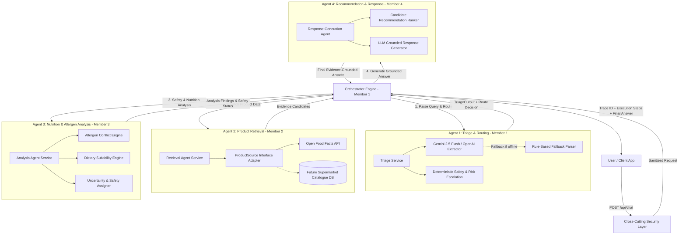

# EviBite AI

**Multi-Agent Supermarket Product Intelligence Assistant**  
IT3041 – Information Retrieval & Web Analytics

EviBite AI is a multi-agent supermarket product intelligence system that helps users ask natural-language questions about packaged food products and receive evidence-grounded answers about product information, nutrition, allergens, dietary suitability, comparisons, and recommendations.

The core prototype uses **Open Food Facts** as its main product-information source. The system is designed as four cooperating agents connected through a shared backend, standardized JSON contracts, and HTTP/REST communication.

> **Current repository stage:** Project structure and shared contracts are being initialized first. Each member will implement their own assigned agent inside the prepared folder structure.

---

## 1. Project Objectives

EviBite AI is designed to demonstrate:

- Multi-agent AI behaviour
- Large Language Model integration
- Natural Language Processing
- Information Retrieval
- Nutrition and allergen analysis
- Grounded recommendation generation
- Agent-to-agent communication using HTTP/REST + JSON
- Security and Responsible AI practices
- Expandable supermarket data-source architecture

The core prototype uses Open Food Facts first. Retailer-specific data such as branch stock, price, promotions, and aisle information can be added later through additional retrieval-source adapters.

---

## 2. Multi-Agent Architecture

The system is designed as a **four-agent cooperative AI architecture** coordinated by a central Orchestration Engine and protected by a cross-cutting security layer.

### System Architecture Diagram



---

### Conditional Execution Paths

Not every query must pass through every agent. The Orchestrator engine dynamically triggers execution paths based on Triage intent and safety requirements:

1. **Simple Product Information**:
   `Triage` $\rightarrow$ `Retrieval` $\rightarrow$ `Response`
2. **Exact Barcode Lookup**:
   `Triage` $\rightarrow$ `Retrieval(Exact)` $\rightarrow$ `Response`
3. **Allergen / Nutrition / Dietary Safety Query**:
   `Triage` $\rightarrow$ `Retrieval` $\rightarrow$ `Analysis` $\rightarrow$ `Response` *(Forces RiskLevel.HIGH and analysis reasoning)*
4. **Product Recommendation & Comparison**:
   `Triage` $\rightarrow$ `Retrieval(Top-K)` $\rightarrow$ `Analysis` $\rightarrow$ `Recommendation/Response`
5. **Missing Product Clarification**:
   `Triage` $\rightarrow$ Stops immediately & requests user clarification.
6. **Out-of-Domain / Unsupported Query**:
   `Triage` $\rightarrow$ `Response` *(Direct polite refusal)*

---

## 3. Team Responsibilities

### Member 1 – Triage & Routing Agent

**Main responsibilities**

- Intent classification
- Entity / slot extraction
- Query decomposition
- Constraint extraction
- Clarification handling
- Risk-sensitive routing
- JSON schema validation
- Agent communication contracts
- Orchestration logic

**Main technical focus**

- NLP
- LLM structured output
- Pydantic validation
- FastAPI
- HTTP/REST + JSON communication

**Primary folder**

```text
backend/app/agents/triage/
backend/app/orchestration/
backend/app/models/
```

---

### Member 2 – Product Information Retrieval Agent

**Main responsibilities**

- Open Food Facts API integration
- Exact barcode lookup
- Product name / brand / category search
- Product-record normalization
- Candidate filtering
- Completeness scoring
- Top-K ranking
- Retrieval retry strategy
- Data-source abstraction for future supermarket connectors

**Main technical focus**

- Information Retrieval
- Open Food Facts
- Ranking and filtering
- Evidence normalization
- Retrieval evaluation

**Primary folder**

```text
backend/app/agents/retrieval/
backend/app/sources/
```

---

### Member 3 – Nutrition & Allergen Analysis Agent

**Main responsibilities**

- Allergen conflict detection
- Nutrition constraint checking
- Dietary suitability analysis
- Product comparisons
- Evidence completeness handling
- Uncertainty states
- Explainable reason generation
- Security implementation
- Responsible AI test cases

**Main technical focus**

- Rule-based reasoning
- Food-information safety
- Responsible AI
- Security middleware
- Evidence-based decision logic

**Primary folder**

```text
backend/app/agents/nutrition_allergen/
backend/app/security/
```

---

### Member 4 – Recommendation & Response Agent

**Main responsibilities**

- Grounded natural-language responses
- Recommendation ranking
- Alternative-product suggestions
- Refusal / uncertainty wording
- Bounded re-retrieval requests
- Frontend development
- Deployment
- Commercialization presentation support

**Main technical focus**

- LLM grounding
- Response generation
- Recommendation logic
- React / frontend
- Deployment

**Primary folder**

```text
backend/app/agents/recommendation_response/
frontend/
```

---

## 4. Planned Repository Structure

```text
EviBite-AI/
│
├── backend/
│   ├── __init__.py
│   │
│   └── app/
│       ├── __init__.py
│       ├── main.py
│       │
│       ├── agents/
│       │   ├── __init__.py
│       │   │
│       │   ├── triage/
│       │   │   └── __init__.py
│       │   │
│       │   ├── retrieval/
│       │   │   └── __init__.py
│       │   │
│       │   ├── nutrition_allergen/
│       │   │   └── __init__.py
│       │   │
│       │   └── recommendation_response/
│       │       └── __init__.py
│       │
│       ├── api/
│       │   └── routes/
│       │
│       ├── models/
│       │
│       ├── orchestration/
│       │
│       ├── sources/
│       │
│       └── security/
│
├── frontend/
│
├── tests/
│   ├── unit/
│   ├── integration/
│   ├── red_team/
│   └── evaluation_queries/
│
├── docs/
│   ├── architecture/
│   └── evaluation/
│
├── .env.example
├── .gitignore
├── requirements.txt
└── README.md
```

At the initialization stage, folders belonging to Members 2, 3, and 4 can remain empty except for `__init__.py` or placeholder files. Their implementations should be added by the relevant member later.

---

## 5. Development Setup

### Prerequisites

Install:

- Python 3.11+ recommended
- Git
- VS Code or another IDE
- Node.js later when frontend development begins

Check Python:

```bash
python --version
```

Check Git:

```bash
git --version
```

---

## 6. Clone the Repository

```bash
git clone <repository-url>
cd EviBite-AI
```

---

## 7. Create a Python Virtual Environment

Create the virtual environment in the **project root**, not inside the `backend` folder.

### Windows PowerShell

```powershell
python -m venv .venv
.\.venv\Scripts\Activate.ps1
```

### Windows Command Prompt

```cmd
python -m venv .venv
.venv\Scripts\activate
```

### macOS / Linux

```bash
python3 -m venv .venv
source .venv/bin/activate
```

After activation, the terminal should show something similar to:

```text
(.venv)
```

---

## 8. Install Backend Dependencies

From the project root:

```bash
pip install -r requirements.txt
```

Backend dependencies include:

```text
fastapi
uvicorn[standard]
pydantic
pytest
google-genai
httpx
python-dotenv
```

Additional dependencies required by individual agents can be added later through reviewed pull requests.

---

## 9. Environment Variables

Copy the example environment file:

### Windows PowerShell

```powershell
Copy-Item .env.example .env
```

### macOS / Linux

```bash
cp .env.example .env
```

Never commit `.env`.

Add your Gemini API Key to `.env`:

```env
GEMINI_API_KEY=your_gemini_api_key_here
```

*(Note: If no API key is provided, the backend automatically uses the built-in rule-based heuristic parser for local offline testing).*

---

## 10. Run the Backend

Run all backend commands from the project root:

```bash
uvicorn backend.app.main:app --reload
```

Default development URL:

```text
http://127.0.0.1:8000
```

Health endpoint:

```text
http://127.0.0.1:8000/health
```

Interactive FastAPI documentation:

```text
http://127.0.0.1:8000/docs
```

---

## 11. Initial API Endpoints

The project will eventually expose logical agent endpoints such as:

```text
POST /agents/triage
POST /agents/retrieval
POST /agents/analysis
POST /agents/response
```

At the initial repository stage, only endpoints that have actually been implemented should be enabled.

Do not create fake working implementations for other members merely to make the endpoints appear complete.

---

## 12. Standard Agent Communication

Agents communicate using:

```text
HTTP/REST + JSON
```

A shared message envelope will follow this general structure:

```json
{
  "trace_id": "REQ-2048",
  "from_agent": "triage",
  "to_agent": "retrieval",
  "message_type": "product_search",
  "payload": {},
  "timestamp": "2026-08-11T00:00:00Z"
}
```

Shared communication contracts belong in:

```text
backend/app/models/
```

Members should reuse the shared models instead of creating incompatible agent-specific message formats.

---

## 13. Shared Status Values

The planned shared statuses include:

```text
OK
FOUND
PARTIAL
NOT_FOUND
SUITABLE
UNSUITABLE
UNCERTAIN
INSUFFICIENT_EVIDENCE
NEED_MORE_EVIDENCE
ERROR
```

These statuses make communication predictable and independently testable.

---

## 14. Responsible AI Rule

The most important safety rule is:

> Missing product information must never be treated as proof that a product is safe.

For example:

```text
allergen field missing
```

does **not** mean:

```text
allergen-free
```

Incomplete allergen, ingredient, or nutrition evidence must produce an uncertainty state rather than an unsupported claim.

---

## 15. Testing

Run tests from the project root:

```bash
pytest
```

Planned test categories:

```text
tests/
├── unit/
├── integration/
├── red_team/
└── evaluation_queries/
```

Each member should add unit tests for their own agent.

Integration tests should be added when two or more agents begin communicating.

---

## 16. Git Workflow

Each member should work on their own branch.

Example:

```bash
git checkout -b member1-triage
```

Possible branch naming:

```text
member1-triage
member2-retrieval
member3-analysis
member4-response
```

Before starting work:

```bash
git checkout main
git pull
```

Then switch to the member branch:

```bash
git checkout member1-triage
```

Commit meaningful changes:

```bash
git add .
git commit -m "Implement triage output schema"
git push origin member1-triage
```

Changes should be integrated through pull requests where possible.

---

## 17. Important Development Rule

The repository structure and shared contracts should be initialized before all four agent implementations are developed.

Each member owns their own agent implementation.

Therefore, during the initial setup:

- Member 1 can initialize the common backend structure.
- Shared Pydantic models and communication contracts can be prepared centrally.
- Empty directories can be created for the other agents.
- Member 2 should implement Retrieval.
- Member 3 should implement Nutrition & Allergen Analysis.
- Member 4 should implement Recommendation & Response.
- One member should not write placeholder implementations that could later be mistaken for another member's contribution.

This keeps Git history and individual contribution evidence clear for the final viva.

---

## 18. Development Sequence

Recommended implementation order:

```text
1. Initialize repository structure
        ↓
2. Define shared JSON contracts
        ↓
3. Validate Open Food Facts fields
        ↓
4. Build Product Retrieval foundation
        ↓
5. Build Triage & Routing
        ↓
6. Build Nutrition & Allergen Analysis
        ↓
7. Build Recommendation & Response
        ↓
8. Integrate all agent endpoints
        ↓
9. Add security middleware
        ↓
10. Run integration and Responsible AI tests
        ↓
11. Build frontend
        ↓
12. Deployment and final evaluation
```

Some agents can be developed in parallel once the shared contracts are stable.

---

## 19. Core Technology Stack

| Component | Technology |
|---|---|
| Backend | Python + FastAPI |
| Validation | Pydantic |
| LLM | Approved LLM API |
| Product Data | Open Food Facts |
| IR | Python filtering, scoring, ranking, Top-K |
| Communication | HTTP/REST + JSON |
| Testing | Pytest |
| Frontend | React |
| Version Control | Git + GitHub |

---

## 20. Current Development Status

```text
Repository initialization        Completed
Shared project structure         Completed
Shared message contracts         Completed
Agent 1 – Triage & Routing       COMPLETED (Member 1 - Gemini LLM + Heuristics)
Orchestration Engine             COMPLETED (Member 1 - POST /api/chat)
Unit Test Suite                  COMPLETED (10/10 Pytest Passed)
Agent 2 – Retrieval              Pending Teammate Integration (Member 2)
Agent 3 – Analysis               Pending Teammate Integration (Member 3)
Agent 4 – Response               Pending Teammate Integration (Member 4)
Frontend UI                      Pending Teammate Integration (Member 4)
```

---

## 21. Guide for Teammates (Member 2, Member 3, Member 4)

Welcome team! **Member 1** has completed **Agent 1 (Triage & Routing)**, the **Gemini LLM Extraction Engine**, the **Multi-Agent Orchestrator Engine**, and the **FastAPI REST API**.

The backend system runs end-to-end today! You can start building your assigned agents immediately by plugging into the prepared folder structure and replacing the stub functions in `backend/app/agents/agent_stubs.py`.

---

### What Member 1 Has Built for You:
1. **Agent 1 (Triage & Routing Agent)** (`backend/app/agents/triage/`):
   - Automatically extracts user intent (`allergen_query`, `nutrition_query`, `comparison`, `product_search`, `barcode_lookup`, `dietary_query`, `recommendation`, `unknown`).
   - Extracts product names, brands, barcodes, categories, allergens, nutrients, dietary requirements, requested fields, and constraints.
   - Powered by **Gemini 2.5 Flash** structured extraction with robust rule-based fallback.
   - Escalates allergen queries to `RiskLevel.HIGH` and determines execution paths.
2. **Orchestrator Engine** (`backend/app/orchestration/orchestrator.py`):
   - Receives incoming user messages at `POST /api/chat`, passes data through Triage $\rightarrow$ Retrieval $\rightarrow$ Analysis $\rightarrow$ Response, tracks Request Trace IDs (`REQ-XXXXXX`), and logs execution steps.
3. **Clean Contract Stubs** (`backend/app/agents/agent_stubs.py`):
   - Contains typed request/response Pydantic schemas and stub functions for Agents 2, 3, and 4.

---

### Exact JSON Output Format Produced by Agent 1 (`POST /agents/triage`)

Your teammates can copy and use these exact JSON objects returned by Agent 1 for their agent development:

#### Example 1: Multi-Intent Allergen & Nutrition Query
**User Query**: *"I have a peanut allergy. Can I eat Nutella and how much sugar does it have?"*

```json
{
  "trace_id": "REQ-72718B96",
  "triage_status": "READY",
  "input_type": "natural_language",
  "original_query": "I have a peanut allergy. Can I eat Nutella and how much sugar does it have?",
  "primary_intent": "allergen_query",
  "secondary_intents": [
    "nutrition_query"
  ],
  "products": [
    {
      "name": "Nutella",
      "brand": null,
      "barcode": null
    }
  ],
  "category": null,
  "requested_fields": [
    "allergens",
    "ingredients",
    "sugars"
  ],
  "allergens": [
    "peanut"
  ],
  "dietary_requirements": [],
  "nutrients": [
    "sugars"
  ],
  "constraints": [],
  "preferences": {},
  "comparison": {
    "metric": null,
    "goal": null
  },
  "subtasks": [
    {
      "intent": "allergen_query",
      "query_fragment": "allergen safety check",
      "target_fields": ["allergens", "ingredients"]
    },
    {
      "intent": "nutrition_query",
      "query_fragment": "nutrient value check",
      "target_fields": ["sugars"]
    }
  ],
  "risk_level": "HIGH",
  "unsupported_requirements": [],
  "clarification": {
    "required": false,
    "missing_fields": [],
    "question": null
  },
  "routing": {
    "next_agent": "retrieval",
    "required_agents": [
      "retrieval",
      "analysis",
      "response"
    ],
    "analysis_required": true
  }
}
```

#### Example 2: Product Comparison Query
**User Query**: *"Which cereal has less sugar and more protein, Cheerios or Special K?"*

```json
{
  "trace_id": "REQ-28DE19B4",
  "triage_status": "READY",
  "input_type": "natural_language",
  "original_query": "Which cereal has less sugar and more protein, Cheerios or Special K?",
  "primary_intent": "comparison",
  "secondary_intents": [],
  "products": [],
  "category": "cereal",
  "requested_fields": [
    "sugars",
    "protein"
  ],
  "allergens": [],
  "dietary_requirements": [],
  "nutrients": [
    "sugars",
    "protein"
  ],
  "risk_level": "MEDIUM",
  "routing": {
    "next_agent": "retrieval",
    "required_agents": [
      "retrieval",
      "analysis",
      "response"
    ],
    "analysis_required": true
  }
}
```

---

### How Each Member Can Start Building:

#### 🔹 Member 2: Product Information Retrieval Agent (Agent 2)
* **Your Main Task**: Retrieve real packaged food records from Open Food Facts API, filter candidates, calculate evidence completeness, and rank Top-K candidates.
* **Where to code**:
  - Main Agent folder: `backend/app/agents/retrieval/`
  - Source adapters: `backend/app/sources/` (`open_food_facts.py`, `base.py`)
* **What you receive from Member 1's Orchestrator**:
  - `RetrievalRequest`: `trace_id`, `query`, `intent`, `products` (e.g. `[{"name": "Nutella"}]`), `category`, `requested_fields`.
* **What you produce**:
  - `RetrievalResponse`: List of `EvidenceObject` candidates containing `name`, `brand`, `ingredients_text`, `allergens`, `nutrition` dictionary, and `completeness` score.
* **How to connect**:
  - Connect your `backend/app/agents/retrieval/service.py` to `stub_retrieval_service()` in `backend/app/agents/agent_stubs.py`.

---

#### 🔹 Member 3: Nutrition & Allergen Analysis Agent (Agent 3)
* **Your Main Task**: Perform food safety reasoning over retrieved evidence, detect allergen conflicts, evaluate dietary constraints, determine safety statuses (`SUITABLE`, `UNSUITABLE`, `UNCERTAIN`), and implement security middleware.
* **Where to code**:
  - Main Agent folder: `backend/app/agents/nutrition_allergen/`
  - Security folder: `backend/app/security/`
* **What you receive from Member 1 & Member 2**:
  - `AnalysisRequest`: `trace_id`, `primary_intent`, `allergens`, `nutrients`, `dietary_requirements`, and retrieved `evidence` candidates.
* **What you produce**:
  - `AnalysisResponse`: `safety_status` (`SUITABLE`, `UNSUITABLE`, `UNCERTAIN`), `risk_level`, `findings` (bullet points explaining reasons), and `uncertainty_reasons`.
* **How to connect**:
  - Connect your `backend/app/agents/nutrition_allergen/service.py` to `stub_analysis_service()` in `backend/app/agents/agent_stubs.py`.

---

#### 🔹 Member 4: Recommendation & Response Agent (Agent 4)
* **Your Main Task**: Generate natural-language grounded responses (no unsupported factual claims), rank recommendations, and format refusal/uncertainty wording. *(Note: Frontend UI development will be built together as a team later).*
* **Where to code**:
  - Main Agent folder: `backend/app/agents/recommendation_response/`
* **What you receive from Member 1, 2 & 3**:
  - `ResponseRequest`: `trace_id`, `query`, `intent`, `triage_status`, `evidence`, and `analysis`.
* **What you produce**:
  - `ResponseResponse`: User-facing `answer` string grounded in verified evidence.
* **How to connect**:
  - Connect your `backend/app/agents/recommendation_response/service.py` to `stub_response_service()` in `backend/app/agents/agent_stubs.py`.

---

## 22. Contributors

| Member | Responsibility | Status |
|---|---|---|
| Member 1 | Triage & Routing Agent + Communication / Orchestration | **Completed** |
| Member 2 | Product Information Retrieval Agent | Pending Integration |
| Member 3 | Nutrition & Allergen Analysis Agent + Security / Responsible AI | Pending Integration |
| Member 4 | Recommendation & Response Agent + Frontend / Deployment | Pending Integration |

Replace `Member 1`, `Member 2`, etc. with actual names before final submission.

---

## 23. Project Scope Limitation

The first version of EviBite AI uses Open Food Facts for packaged-product information.

The MVP does not currently provide:

- Live supermarket stock
- Branch-specific availability
- Real supermarket prices
- Promotions
- Aisle locations
- Checkout or payment functionality

The retrieval architecture is intended to allow supermarket-specific sources to be added later without redesigning the four-agent architecture.

