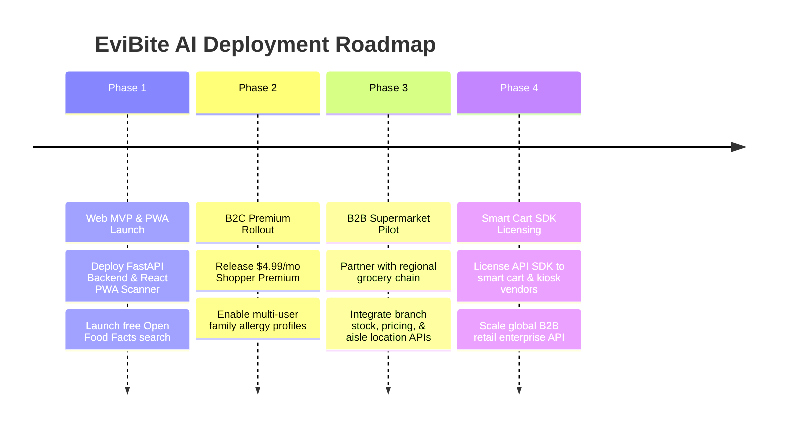

# EviBite AI — Commercialization Strategy & Business Model

**IT3041 – Information Retrieval & Web Analytics**

---

## 1. Executive Summary

EviBite AI is a multi-agent supermarket product intelligence system designed to process natural language user queries regarding packaged food products. The platform combines Large Language Model (LLM) intent understanding with live Information Retrieval (Open Food Facts) and deterministic food safety rule evaluation.

This commercialization strategy outlines the market opportunity, target customer personas, dual B2C/B2B revenue streams, competitive matrix, and a 4-phase Go-To-Market (GTM) deployment roadmap.

---

## 2. Market Opportunity & Target Personas

### Target Audience Breakdown

```
                                  EviBite AI Market
                                          │
         ┌────────────────────────────────┴────────────────────────────────┐
         ▼                                                                 ▼
B2C Market: Health & Allergy Shoppers                           B2B Market: Retailers & E-Commerce
  • Severe Allergy Sufferers (Celiac, Peanuts, Dairy, Soy)       • Supermarket Retail Chains (Kiosks & Apps)
  • Lifestyle Diets (Vegan, Vegetarian, Halal, Keto)              • Grocery E-Commerce Platforms
  • Chronic Health Management (Diabetes, Hypertension)            • Smart Shopping Cart & IoT Hardware Vendors
```

1. **B2C Consumer Persona: Allergy & Health-Conscious Shopper**
   * Needs instant, zero-risk verification of packaged food ingredients and allergen cross-contamination.
   * Seeks personalized dietary recommendations (e.g. low-sugar, high-protein, gluten-free).

2. **B2B Retailer Persona: Supermarket Chain Innovation Lead**
   * Wants to increase customer basket size and in-app engagement by providing intelligent, voice/text food search.
   * Requires seamless integration with existing inventory, pricing, and aisle location databases via API connectors.

---

## 3. Dual Revenue & Tiered Pricing Model

EviBite AI implements a **dual B2C SaaS subscription and B2B API licensing model**:

### A. B2C Consumer Subscription Tiers

| Tier Name | Target User | Price | Core Features |
| :--- | :--- | :--- | :--- |
| **Free Tier** | Casual Shoppers | **$0 / month** | • 10 product scans/queries per day<br>• Basic allergen warning flags<br>• Nutri-Score & Eco-Score display |
| **Shopper Premium** | Daily Allergy & Fitness Shoppers | **$4.99 / month**<br>*(or $44.99/yr)* | • Unlimited barcode & natural language queries<br>• Family Allergy Profiles (up to 5 profiles)<br>• Custom nutrient threshold goals (low-sugar, high-protein)<br>• Instant healthier alternative recommendations |

### B. B2B Enterprise API Tiers

| Tier Name | Target Partner | Price | Core Features |
| :--- | :--- | :--- | :--- |
| **API Starter** | Independent Grocers & Local Apps | **$299 / month** | • Up to 50,000 API calls / month<br>• REST API for food search & allergen checking<br>• Standard email support |
| **Retail Enterprise** | National Supermarket Chains | **$1,499 / month** | • Up to 500,000 API calls / month<br>• Custom Database Adapter (Live branch stock, price, aisle API)<br>• Smart Shopping Cart & In-Store Kiosk SDK<br>• 99.9% uptime SLA & dedicated technical account manager |

---

## 4. Competitive Matrix

| Feature / Capability | Raw ChatGPT / LLM | Generic Barcode Scanner | **EviBite AI** |
| :--- | :---: | :---: | :---: |
| **Allergen Accuracy** | Risk of Hallucinations | Simple Static Label Text | **Zero-Hallucination Deterministic Rule Engine** |
| **Multi-Agent Orchestration** | Single Model | None | **4 Cooperating Specialized Agents** |
| **Natural Language Queries** | High | Low / None | **High (Pydantic Intent & Slot Extraction)** |
| **Explainable Evidence** | Low | Low | **High (Full Evidence & Uncertainty Tracing)** |
| **Retailer DB Integration** | None | Rare | **Extensible Abstract `ProductSource` Connector** |

---

## 5. Go-To-Market (GTM) Deployment Roadmap



---

## 6. Responsible AI & Trust Strategy

* **Explainability**: Every safety status (`SUITABLE`, `UNSUITABLE`, `UNCERTAIN`) is accompanied by explicit evidence findings.
* **Safety First**: High-risk queries automatically trigger deterministic analysis engines rather than ungrounded generative text.
* **Transparency**: Open Food Facts data missing ingredients or nutrition specs are explicitly flagged with `INSUFFICIENT_EVIDENCE` status.
